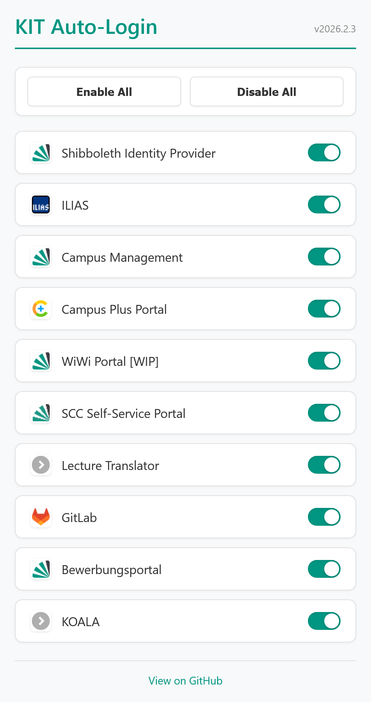
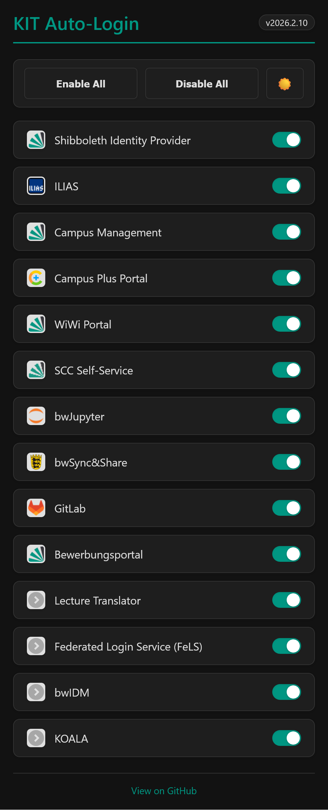

# KIT Auto-Login

> **Disclaimer:** This extension is an independent, open-source project and is **not** affiliated with, endorsed by, or officially connected to the Karlsruhe Institute of Technology (KIT) in any way.

## Features

- **Automatic Login:** Zero-click login on desktop and one-click login on iOS for various KIT services
- Works seamlessly with your existing password managers
- Enable or disable the extension for each supported site individually

## Installation

### Firefox
[Get it on Mozilla Add-ons (AMO)](https://addons.mozilla.org/de/firefox/addon/kit-auto-login/)

### Chromium (Chrome, Edge, etc.)
[Get it on Chrome Web Store](https://chromewebstore.google.com/detail/kit-auto-login/ldnjffkimlpofjanbfdipcannfaloabd)

### iOS (Safari)
Passkey-based support for one-click logins is provided.
1. If you haven't already, register a passkey for your account at the [SCC Self-Service Portal](http://my.scc.kit.edu/).
2. Install the [Userscripts](https://apps.apple.com/de/app/userscripts/id1463298887) app from the App Store.
3. Activate the Userscripts Safari extension in the iOS Settings app.
4. Copy `kit_auto_login_userscript.js` into the Userscripts directory on your iOS device.
5. For each site where you want to use auto-login, manually allow Userscripts to run by pressing the extension button in Safari and granting access.

## Prerequisites

This extension automates the clicking of login buttons, but it **does not store your passwords, passkeys, or cookies**. 

- **Desktop:** For fully automatic login, ensure your password manager (or browser) is configured to autofill your KIT username and password.
- **iOS:** The iOS version works via Passkeys (as there is currently no way to automatically fill in passwords without additional button presses). Make sure to register a Passkey for your account first.

## Screenshot & Supported Sites

  
  

Tip: Click on any site in the list to quickly jump to the respective KIT portal.

## Contributing

Contributions are welcome! Please feel free to open a pull request or open an issue to report a bug.

## Credits

- Original idea and extension by [philippweinmann](https://github.com/philippweinmann/iliasLogin)
- ILIAS v7.x fix by [BenedictLoe](https://github.com/BenedictLoe/iliasLogin_7)